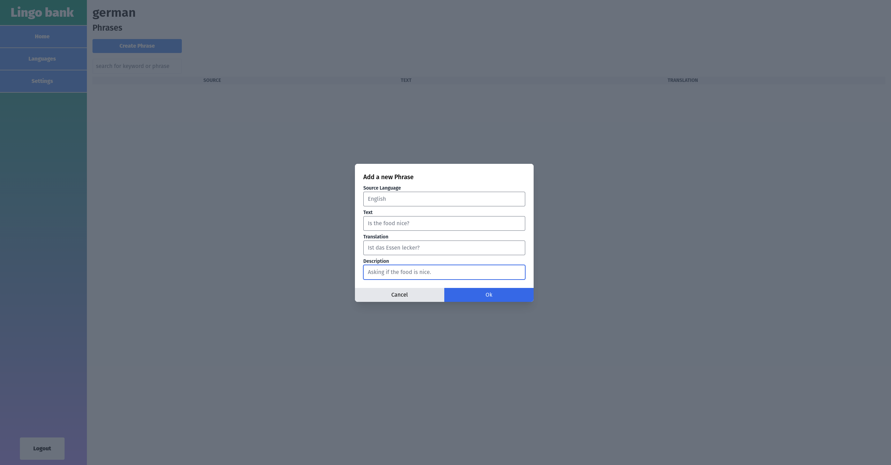

# LingoBank
## Knowledge base app to track your language learning progress.
This app is designed to complement your language learning process while using some other service (i.e. Duolingo). Any words or phrases you learn can be inserted into this app, and can be retrieved at a later time.

Work in progress, pre pre pre alpha.

### Screenshots
Home Page

List of users languages

Create a new phrase for a language

